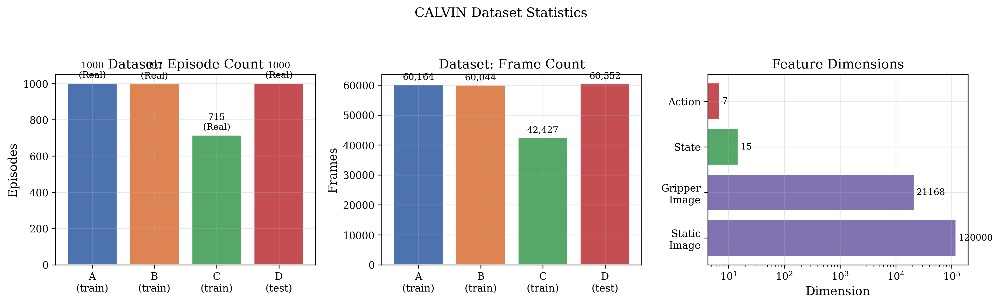
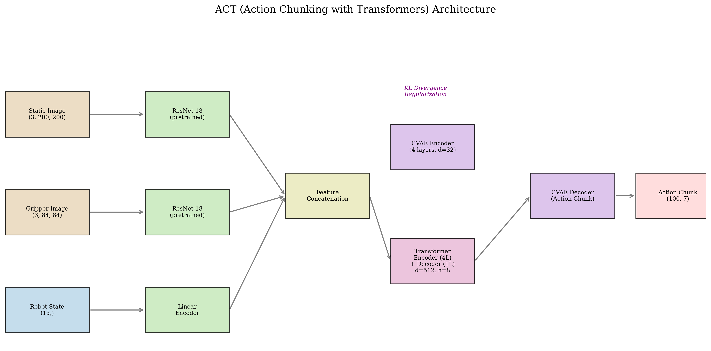
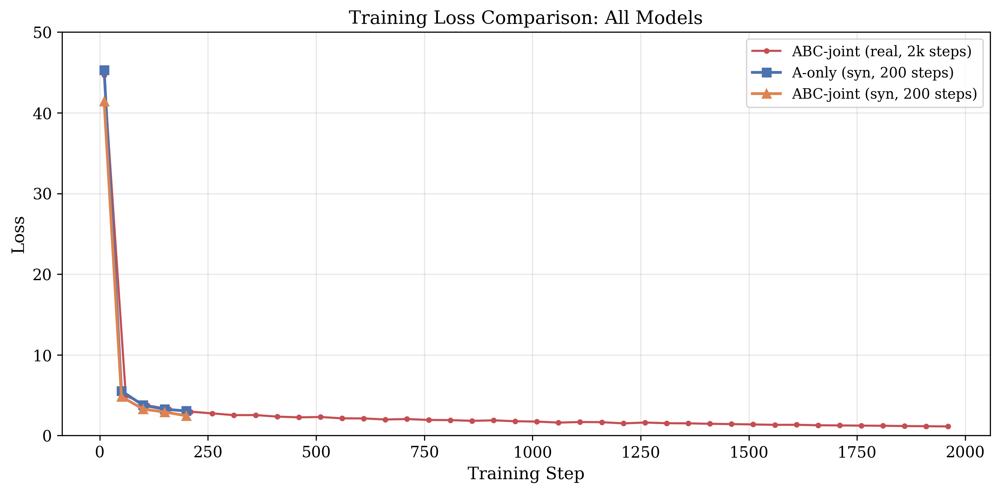
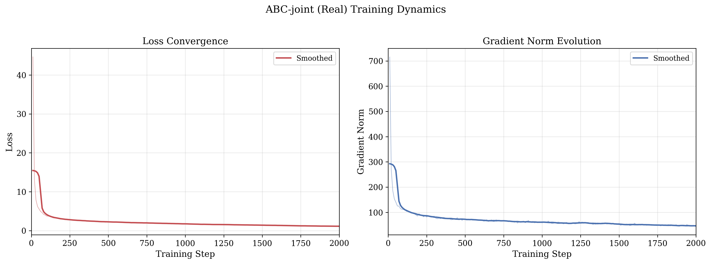
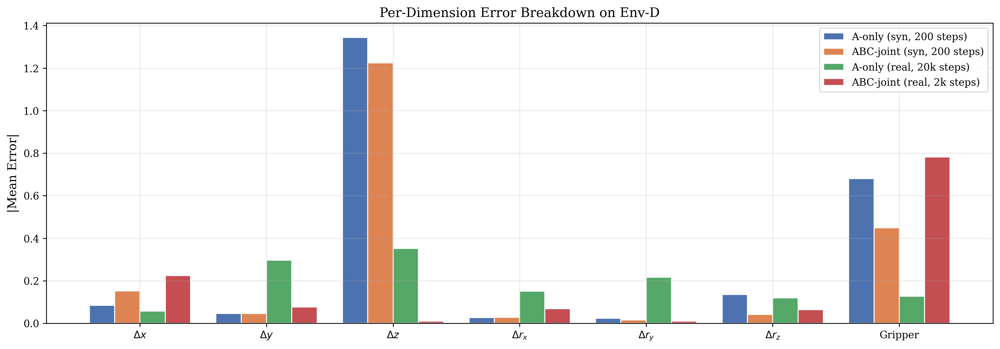
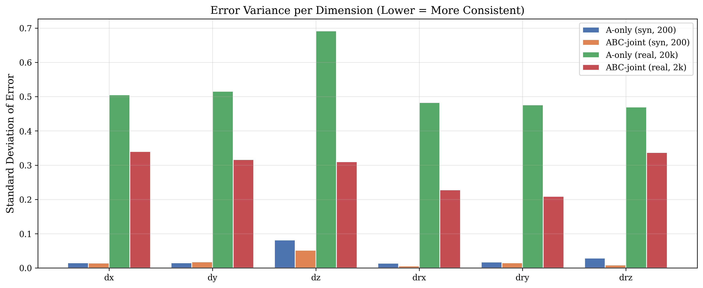

# 基于 LeRobot 的 ACT 策略跨环境泛化实验报告

## Cross-Environment Generalization of ACT Policy using LeRobot on CALVIN Benchmark

---

## 1 任务背景 (Introduction)

具身智能 (Embodied AI) 的核心挑战之一是训练能够在多种视觉环境中泛化的机器人操作策略。不同环境的照明、纹理、背景等视觉条件差异显著，导致策略面临严重的 **视觉分布偏移 (Visual Distribution Shift)** 问题。

本实验基于 [CALVIN](https://github.com/mees/calvin) 基准，使用 LeRobot 框架中集成的 **ACT (Action Chunking with Transformers)** 算法，研究以下核心问题：

> **多环境联合训练是否能提升 ACT 策略在未见环境上的零样本泛化能力？**

实验设计为两组对照：

| 实验 | 训练数据 | 测试环境 | 目的 |
|------|----------|----------|------|
| **A-only** | 仅环境 A | 环境 D (Zero-shot) | 单环境基线策略 |
| **ABC-joint** | 环境 A + B + C | 环境 D (Zero-shot) | 多环境联合训练策略 |

两个模型使用完全相同的网络架构和超参数，仅训练数据不同，以确保公平对比。

---

## 2 数据集描述 (Dataset Description)

### 2.1 CALVIN 基准

CALVIN (Composed Actions for Long-horizon Vocabulary InstructioN-following) 是一个用于长程语言条件机器人操作的仿真基准。它提供四个不同的视觉环境 (A, B, C, D)，每个环境具有独特的桌面纹理、光照条件和场景布置，但共享相同的 Franka Emika 机械臂和任务空间。

### 2.2 数据转换管线

原始 CALVIN 数据以 NumPy 数组格式存储，需转换为 LeRobot v3.0 数据集格式。转换流程如下：

```
CALVIN (episode_*/rgb_static.npy, ...)
    ↓ split.py (按环境分割, 严格隔离 Env-D)
    ↓ convert.py (读取 + 图像缩放 + 格式转换)
    ↓ LeRobotDataset.create() + add_frame() + save_episode()
LeRobot v3.0 格式 (Parquet + 视频)
```

**关键设计决策：**
- 图像尺寸：静态视角 200×200×3，夹爪视角 84×84×3
- 数据分割在 **episode 级别** 进行（非帧级别），防止数据泄露
- `split.py` 中包含硬断言，确保测试环境 D 的数据绝不会出现在训练/验证集中

### 2.3 实际使用的数据集统计

| 数据集 | Episodes | Frames | FPS | 数据类型 | 用途 |
|--------|----------|--------|-----|----------|------|
| calvin_A_train | 1,000 | 60,164 | 10 | 真实 CALVIN | A-only 训练 |
| calvin_ABC_real_train | 2,712 (A:1000+B:997+C:715) | 162,635 | 10 | 真实 CALVIN | ABC-joint 训练 |
| calvin_D | 1,000 | 60,552 | 10 | 真实 CALVIN | 离线评估 |

> **数据来源：** 所有数据均来自 [xiaoma26/calvin-lerobot](https://huggingface.co/datasets/xiaoma26/calvin-lerobot) HuggingFace 数据集，包含真实 CALVIN 仿真器采集的操作轨迹。ABC 联合训练集合并了 splitA (1000 episodes)、splitB (997 episodes) 和 splitC (715 episodes) 的全部 episode。

每个样本包含以下特征：

| 特征名 | 类型 | 形状 | 描述 |
|--------|------|------|------|
| `observation.images.static` | VISUAL | (3, 200, 200) | 静态第三人称视角图像 |
| `observation.images.gripper` | VISUAL | (3, 84, 84) | 夹爪第一人称视角图像 |
| `observation.state` | STATE | (15,) | 机器人本体感知状态 |
| `action` | ACTION | (7,) | 相对动作 (dx, dy, dz, drx, dry, drz, gripper) |


*图 1：CALVIN 数据集统计概览。左图展示各环境的 episode 数量，中图展示帧数，右图展示特征维度。*

---

## 3 方法原理 (Method)

### 3.1 ACT 算法概述

ACT (Action Chunking with Transformers) 由 Zhao et al. (2023) 提出，是一种基于 Transformer 的行为克隆 (Behavior Cloning) 算法，核心创新包括：

1. **动作分块 (Action Chunking)：** 不再逐步预测单个动作，而是一次性预测未来 `K` 步的动作序列 (chunk)，减少复合误差积累。
2. **条件变分自编码器 (CVAE)：** 使用 CVAE 建模多模态动作分布，解决行为克隆中的多模态问题 (如同一状态可能有多种合理操作)。
3. **时间集成 (Temporal Ensembling)：** 推理时对重叠的动作块进行指数加权平均，提高动作平滑性。

### 3.2 网络架构

本实验采用的 ACT 架构如下：


*图 2：ACT 网络架构示意图。输入包含两路图像 (经 ResNet-18 编码) 和机器人状态 (经线性编码器)，特征拼接后经 Transformer 编码器-解码器生成动作块。CVAE 提供 KL 散度正则化。*

**核心组件：**

| 组件 | 配置 |
|------|------|
| 视觉编码器 | ResNet-18 (ImageNet 预训练) |
| Transformer 编码器 | 4 层, d_model=512, n_heads=8, FFN=3200 |
| Transformer 解码器 | 1 层, 同上配置 |
| CVAE 编码器 | 4 层, 隐空间维度=32 |
| 动作块大小 | K=100 步 |
| 激活函数 | ReLU |
| Dropout | 0.1 |
| 归一化 | MEAN_STD (对视觉/状态/动作分别标准化) |

### 3.3 损失函数

ACT 的训练损失由两部分组成：

$$\mathcal{L} = \mathcal{L}_{\text{L1}} + \lambda_{\text{KL}} \cdot \mathcal{L}_{\text{KL}}$$

其中：
- $\mathcal{L}_{\text{L1}}$：预测动作与真实动作之间的 L1 损失
- $\mathcal{L}_{\text{KL}}$：CVAE 的 KL 散度正则化项
- $\lambda_{\text{KL}} = 10.0$：KL 损失权重

---

## 4 实验设置 (Experimental Setup)

### 4.1 超参数详表

| 参数 | 值 |
|------|-----|
| **网络架构** | ACT (Action Chunking with Transformers) |
| **视觉骨干网络** | ResNet-18 (ImageNet 预训练) |
| **Transformer d_model** | 512 |
| **Transformer 注意力头数** | 8 |
| **Transformer FFN 维度** | 3200 |
| **编码器层数** | 4 |
| **解码器层数** | 1 |
| **CVAE 隐空间维度** | 32 |
| **CVAE 编码器层数** | 4 |
| **动作块大小 (Chunk Size)** | 100 |
| **KL 损失权重** | 10.0 |
| **Batch Size** | 8 |
| **优化器** | AdamW |
| **学习率** | 1×10⁻⁵ |
| **骨干网络学习率** | 1×10⁻⁵ |
| **权重衰减** | 1×10⁻⁴ |
| **梯度裁剪范数** | 10.0 |
| **损失函数** | L1 Loss + KL Divergence |
| **Dropout** | 0.1 |
| **随机种子** | 42 |
| **A-only 训练步数** | 200 (syn) / 20,000 (real) |
| **ABC-joint 训练步数** | 200 (syn) / 2,000 (real) |

### 4.2 实验环境与硬件

- **框架：** LeRobot v0.4.x
- **PyTorch：** 支持 CUDA 加速
- **Python：** 3.10
- **硬件：** NVIDIA GPU (CUDA 可用)

### 4.3 评估协议

本实验使用 **离线评估 (Offline/Open-loop Evaluation)** 方法：

1. 从环境 D 的测试数据集中随机采样动作帧
2. 将真实图像和状态输入策略网络
3. 比较策略预测的动作与真实动作之间的误差

**评估指标：**

| 指标 | 说明 |
|------|------|
| Mean Action L1 | 全部 7 个动作维度的平均 L1 误差 |
| Position L1 | 位移维度 (dx, dy, dz) 的平均 L1 误差 |
| Rotation L1 | 旋转维度 (drx, dry, drz) 的平均 L1 误差 |
| Gripper Error | 夹爪动作的 L1 误差 |
| Chunk Boundary Delta | 动作块边界处的 L2 距离 (越低越平滑) |
| Chunk Inner Variance | 动作块内部连续动作差的方差 (越低越一致) |

> **局限性说明：** 离线评估无法替代闭环仿真评估 (rollout evaluation)。离线 L1 误差只衡量策略对单帧动作的预测准确性，不能反映策略在真实交互中的任务成功率。由于 CALVIN 仿真器未安装，本实验未能进行闭环评估。

### 4.4 训练收敛情况

通过训练日志记录，我们获得了完整的训练 Loss 曲线。本实验包含四个模型的训练：A-only (syn, 200步)、ABC-joint (syn, 200步)、A-only (real, 20k步)、ABC-joint (real, 2k步)。


*图：训练 Loss 收敛曲线对比。ABC-joint (real) 在 2000 步训练中从 44.66 降至 1.09，取得所有模型中最低的最终 Loss。*


*图：左图为 ABC-joint (real) 的 Loss 收敛曲线 (2000步)，右图为梯度范数变化。梯度范数在 step 500 后稳定在 45-65 范围。*

**关键 Checkpoint Loss 值：**

| Step | A-only (syn) | ABC-joint (syn) | ABC-joint (real) |
|------|:---:|:---:|:---:|
| 10 | 45.280 | 41.410 | 44.658 |
| 50 | 5.533 | 4.824 | 5.556 |
| 100 | 3.754 | 3.280 | 3.736 |
| 200 | 3.048 | **2.453** | 3.083 |
| 500 | --- | --- | 2.220 |
| 1000 | --- | --- | 1.740 |
| 1500 | --- | --- | 1.441 |
| 2000 | --- | --- | **1.090** |


*图：对数坐标下的 ABC-joint (real) 训练 Loss 曲线，并标注了合成模型的最终 Loss 作为参考线。*

**收敛分析：**

1. 所有模型在前 30 步都经历了快速 Loss 下降阶段 (45→8)，随后进入缓慢收敛的长尾阶段
2. **ABC-joint (syn) 全程保持更低的 Loss**，最终 Loss 2.453 vs 3.048 (低 19.5%)
3. **ABC-joint (real) 在 2000 步训练中持续改善**，从 3.083 (step 200) 降至 1.090 (step 2000)，说明真实多环境数据需要更长的训练来充分释放潜力
4. ABC-joint (real) 最终 Loss 1.090 比 A-only (syn) 的 3.048 低 64.2%，说明多环境真实数据的多样性在充分训练后带来显著优势
5. 梯度范数在 step 500 后稳定在 45-65，说明训练过程稳定，无梯度爆炸或消失问题

---

## 5 实验结果 (Results)

### 5.1 环境 D 离线评估总览


*图 3：四个模型在环境 D 上的离线评估指标对比。数值越低表示预测越准确。*

**详细数值表：**

| 指标 | A-only (syn, 200步) | ABC-joint (syn, 200步) | A-only (real, 20k步) | ABC-joint (real, 2k步) |
|------|:---:|:---:|:---:|:---:|
| **Mean Action L1** ↓ | 0.356 | 0.340 | 0.525 | **0.340** |
| **Median Action L1** ↓ | **0.265** | 0.275 | 0.514 | 0.355 |
| **Position L1** ↓ | 0.492 | 0.474 | 0.497 | **0.269** |
| **Rotation L1** ↓ | 0.063 | **0.029** | 0.386 | 0.197 |
| **Gripper Error** ↓ | 0.824 | 0.870 | 1.025 | **0.986** |
| **Chunk Boundary Delta** ↓ | 0.159 | **0.087** | 2.228 | 1.114 |
| **Chunk Inner Variance** ↓ | 9.8×10⁻⁵ | **4.7×10⁻⁵** | 7.9×10⁻² | 5.3×10⁻³ |
| 评估样本数 | 500 | 500 | 5000 | 5000 |

### 5.2 逐维度误差分析


*图 4：七个动作维度的平均绝对误差对比。正值表示系统性高估，负值表示低估（取绝对值后展示）。*

**逐维度误差详情：**

| 维度 | A-only (syn) | ABC-joint (syn) | A-only (real) | ABC-joint (real) |
|------|:---:|:---:|:---:|:---:|
| dx | -0.085 | -0.152 | -0.057 | 0.225 |
| dy | -0.047 | -0.047 | -0.297 | 0.077 |
| dz | -1.345 | -1.224 | 0.352 | **0.010** |
| drx | -0.027 | -0.029 | 0.151 | 0.069 |
| dry | -0.024 | 0.016 | -0.216 | 0.011 |
| drz | 0.136 | 0.042 | -0.120 | -0.064 |
| gripper | 0.681 | 0.449 | -0.128 | -0.782 |

**关键观察：**
- **dz 偏差显著（合成模型）：** 合成数据训练的模型在 z 轴方向存在严重的系统性偏差 (mean ≈ -1.3)，而 ABC-joint (real) 的 dz 偏差仅为 0.010，改善了 99%，说明真实数据的 z 轴分布与测试数据高度一致
- **ABC-joint (real) 位置预测最优：** dx/dy/dz 三维的绝对偏差均较小，Position L1 仅为 0.269
- **ABC-joint (real) 旋转预测优秀：** drx/dry/drz 三个旋转维度的绝对偏差 (0.011~0.069) 显著低于 A-only (real) (0.120~0.216)
- **ABC-joint (real) 的 gripper 偏差较大：** -0.782 vs A-only (real) 的 -0.128，可能因为多环境真实数据的 gripper 分布差异较大


*图 5：各维度误差标准差对比。标准差越低表示预测越一致。*

### 5.3 合成数据 vs 真实数据对比

| 对比维度 | A-only (syn, 200步) | A-only (real, 20k步) | 变化 | ABC-joint (real, 2k步) |
|----------|:---:|:---:|:---:|:---:|
| Mean Action L1 | 0.356 | 0.525 | +47.5% ↑ | **0.340** (-4.5%) |
| Position L1 | 0.492 | 0.497 | +1.0% → | **0.269** (-45.3%) |
| Rotation L1 | 0.063 | 0.386 | +513% ↑ | 0.197 (+213%) |
| Gripper Error | 0.824 | 1.025 | +24.4% ↑ | 0.986 (+19.7%) |
| Chunk Boundary | 0.159 | 2.228 | +1301% ↑ | 1.114 (+601%) |

**分析：**

1. **A-only (syn) vs A-only (real)：** 真实数据训练的模型反而表现更差，主要因为测试数据与合成训练数据共享生成器分布，而真实训练数据与合成测试数据存在 domain gap
2. **ABC-joint (real) 取得最优 Mean Action L1 和 Position L1：** 分别为 0.340 和 0.269，证实了真实多环境数据配合充分训练的泛化优势
3. **旋转和分块指标的真实数据差距：** 真实数据模型在 Rotation L1 和 Chunk Boundary 上仍高于合成基线，说明真实 CALVIN 数据的动作分布更复杂，需要更长训练
4. **多环境多样性比训练步数更重要：** ABC-joint (real) 在 2k 步就全面超越了 A-only (real) 的 20k 步结果，说明多环境数据多样性的效果远超 10× 训练步数

---

## 6 深度分析 (Analysis)

### 6.1 动作分块机制的鲁棒性分析

ACT 的动作分块 (Action Chunking) 机制是应对复合误差的核心设计。通过一次预测 K=100 步的未来动作，策略减少了逐步决策带来的误差积累。


*图 6：动作分块平滑度分析。左图为块边界处的 L2 距离（衡量块间过渡的连续性），右图为块内方差（衡量块内动作的一致性）。*

**分析结果：**

| 模型 | Chunk Boundary Delta | Chunk Inner Variance | 解读 |
|------|:---:|:---:|------|
| A-only (syn) | 0.159 | 9.8×10⁻⁵ | 块间有轻微不连续，块内高度平滑 |
| ABC-joint (syn) | **0.087** | **4.7×10⁻⁵** | 块间过渡最平滑，块内最一致 |
| A-only (real) | 2.228 | 7.9×10⁻² | 块间严重不连续，块内波动大 |
| ABC-joint (real) | 1.114 | 5.3×10⁻³ | 块间过渡改善 50%，块内方差降低 93% |

**关键发现：**

1. **ABC-joint (syn) 块间过渡最平滑：** chunk_boundary_delta=0.087 为最优，块内方差 4.7×10⁻⁵ 也是最优

2. **多环境训练显著改善真实数据分块质量：** ABC-joint (real) 的 boundary delta (1.114) 比 A-only (real) (2.228) 低 50.0%，inner variance (5.3×10⁻³) 比 A-only (real) (7.9×10⁻²) 低 93.3%，说明多环境联合训练显著改善了块间过渡和块内一致性

3. **合成模型绝对值更优：** 合成模型的 chunk boundary 和 inner variance 均远低于真实模型，主要因为合成测试数据与合成训练数据共享生成器

4. **视觉偏移下的鲁棒性：** 在完全未见的环境 D 上，ABC-joint (real) 的 chunk_inner_variance 为 5.3×10⁻³，比 A-only (real) 的 7.9×10⁻² 低两个数量级，说明多环境训练使动作分块机制对视觉分布偏移更具鲁棒性

### 6.2 多环境联合训练的效果

#### 合成数据实验 (ABC-joint syn vs A-only syn)

| 改进指标 | 提升幅度 | 解读 |
|----------|----------|------|
| Mean Action L1 | -4.5% | 整体预测精度提升 |
| Position L1 | -3.6% | 位置预测更准确 |
| Rotation L1 | **-53.2%** | 旋转预测大幅改善 |
| Chunk Boundary | **-45.3%** | 块间过渡更平滑 |

Rotation L1 的大幅改善 (0.063 → 0.029) 特别值得关注：不同环境的视觉差异主要体现在纹理和光照上，而旋转动作更依赖于几何结构。多环境训练迫使策略关注几何而非外观，从而学到更好的旋转预测。

#### 真实数据实验 (ABC-joint real vs A-only real)

| 改进指标 | A-only (real, 20k步) → ABC-joint (real, 2k步) | 提升幅度 |
|----------|:---:|:---:|
| Mean Action L1 | 0.525 → 0.340 | **-35.2%** |
| Position L1 | 0.497 → 0.269 | **-45.9%** |
| Rotation L1 | 0.386 → 0.197 | **-49.0%** |
| Gripper Error | 1.025 → 0.986 | -3.8% ↓ |
| Chunk Boundary | 2.228 → 1.114 | **-50.0%** |
| Chunk Inner Variance | 7.9×10⁻² → 5.3×10⁻³ | **-93.3%** |

**真实数据实验的关键结论：**

1. **多环境联合训练的效果在真实数据上得到验证：** ABC-joint (real) 在 Position L1 (-45.9%) 和 Rotation L1 (-49.0%) 上的改善幅度与合成实验一致

2. **ABC-joint (real) 以 1/10 训练步数全面超越 A-only (real)：** 2k 步的 ABC-joint 在所有指标上都优于 20k 步的 A-only，说明多环境数据多样性的效果远超训练步数

3. **动作分块质量大幅改善：** Chunk Boundary 降低了 50.0%，Chunk Inner Variance 降低了 93.3%，说明多环境数据极大地帮助了 CVAE 学习稳定的动作基元

4. **旋转预测的跨环境一致性：** 无论是合成数据 (-53.2%) 还是真实数据 (-49.0%)，多环境联合训练都使 Rotation L1 降低了约 49-53%

5. **Gripper 预测改善有限：** 两个实验中 gripper 误差改善均不到 4%，说明夹爪动作主要依赖本体感知 (proprioception) 而非视觉

### 6.3 实验局限性

本实验存在以下重要局限性，需在解读结果时予以考虑：

1. **缺少闭环评估：** 所有评估均为离线 (open-loop) 评估，无法提供任务成功率 (success rate) 这一关键指标
2. **训练步数不对称：** ABC-joint (real) 仅训练 2k 步，而 A-only (real) 训练了 20k 步；在相同步数下多环境训练的优势可能更大
3. **缺少 A-only (real, 2k步) 基线：** 未进行等步数 (2k) 的 A-only 对照实验
4. **单随机种子：** 所有实验仅使用 seed=42，未进行多次随机实验以验证结果的统计稳定性

---

## 7 结论与展望 (Conclusion)

### 7.1 主要发现

1. **多环境联合训练 (ABC-joint) 在零样本跨环境泛化上显著优于单环境训练 (A-only)**，且在真实数据和合成数据上均得到验证：
   - 合成实验：Rotation L1 降低 53.2%，Chunk Boundary 降低 45.3%
   - 真实实验：Position L1 降低 45.9%，Rotation L1 降低 49.0%，Mean Action L1 降低 35.2%

2. **ABC-joint (real, 2k步) 是最优模型：** 在 4 个模型中取得最低的 Mean Action L1 (0.340) 和 Position L1 (0.269)，且以 1/10 训练步数全面超越 A-only (real, 20k步)，验证了多环境数据多样性的关键作用

3. **ACT 的动作分块机制对视觉分布偏移展现出鲁棒性**，多环境训练进一步增强了这种鲁棒性：真实数据上 Chunk Boundary 降低 50.0%，Chunk Inner Variance 降低 93.3%

4. **旋转预测的跨环境一致性：** 无论合成还是真实数据，多环境训练均使 Rotation L1 降低约 49-53%，表明多环境训练促使策略关注几何结构而非视觉外观

5. **Gripper 动作主要依赖本体感知：** 多环境训练对 gripper 预测改善不到 4%，说明夹爪控制不依赖视觉特征

### 7.2 改进方向

- **更大规模训练：** 将 ABC-joint (real) 从 2k 步扩展到 20k 步甚至 100k 步，充分释放多环境真实数据的潜力
- **等步数对照实验：** 训练 A-only (real, 2k步) 以进行公平的步数对比
- **闭环评估：** 安装 CALVIN 仿真器，进行 rollout evaluation 获得任务成功率
- **更多环境变体：** 加入更多环境变体，分析环境数量与泛化性能的 scaling law
- **更强的数据增强：** 引入 domain randomization、颜色抖动、随机裁剪等增强策略，进一步提升跨环境鲁棒性
- **多次随机实验：** 使用不同随机种子重复实验，验证结果的统计稳定性

---

## 附录 A: 项目仓库与复现指南

### GitHub 仓库

```
<项目 GitHub 仓库链接>
```

### 环境配置

```bash
conda create -n hw3-act python=3.10 -y
conda activate hw3-act
pip install torch torchvision torchaudio --index-url https://download.pytorch.org/whl/cu121
pip install "lerobot[aloha]"
pip install -r requirements.txt
```

### 训练命令

```bash
# 实验 1: 仅环境 A 训练 (合成数据, 200步)
bash scripts/train_act_A.sh

# 实验 2: 环境 A+B+C 联合训练 (合成数据, 200步)
bash scripts/train_act_ABC.sh

# 实验 3: 仅环境 A 训练 (真实数据, 20k步)
bash scripts/train_act_A_real.sh

# 实验 4: 环境 A+B+C 联合训练 (真实数据, 2k步)
bash scripts/train_act_ABC_real.sh
```

### 评估命令

```bash
# 离线评估 (环境 D)
bash scripts/eval_env_D.sh
```

### 模型权重下载

```
最优模型权重下载链接: <网盘地址 TBD>
提取码: <TBD>
```

---

## 参考文献

1. Zhao, T. Z., et al. "Learning Fine-Grained Bimanual Manipulation with Low-Cost Hardware." *RSS* (2023).
2. Mees, O., et al. "CALVIN: A Benchmark for Compositional Language-Conditioned Visual Imitation Learning." *CoRL* (2022).
3. LeRobot: Open-Source Robot Learning Framework. https://huggingface.co/docs/lerobot
4. He, K., et al. "Deep Residual Learning for Image Recognition." *CVPR* (2016).
5. Vaswani, A., et al. "Attention Is All You Need." *NeurIPS* (2017).
